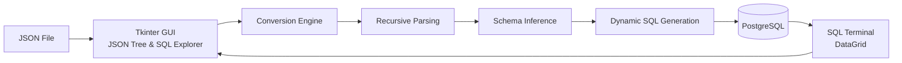
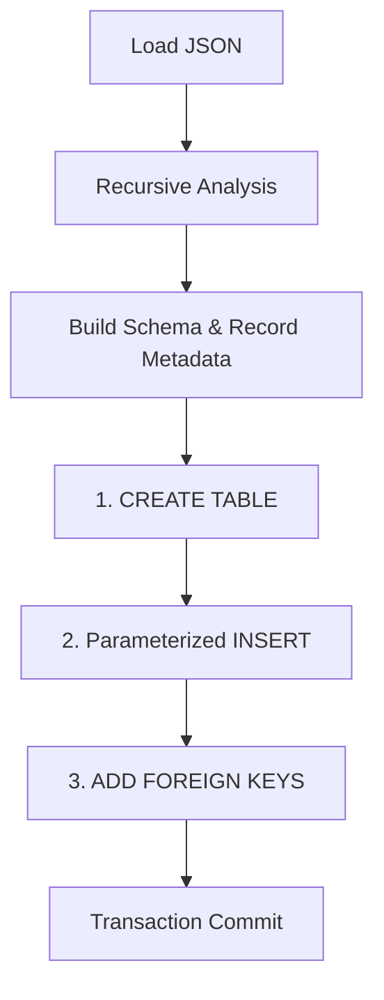
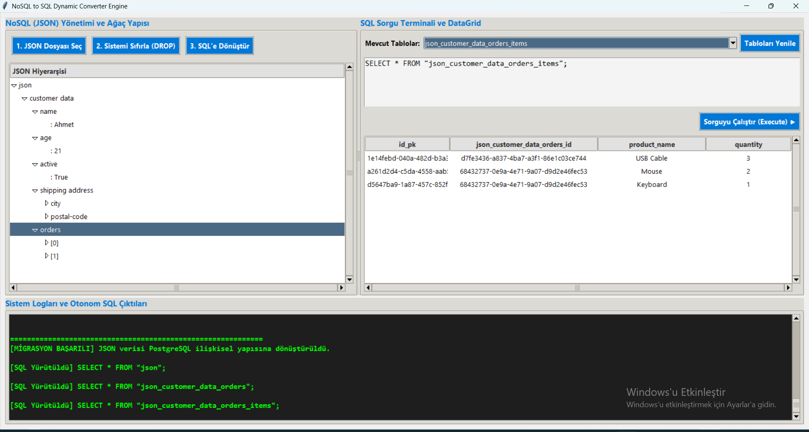

# 🔄 Dynamic JSON to PostgreSQL Engine

A recursive **JSON-to-relational conversion engine** written in Python that analyzes semi-structured JSON data at runtime, infers a relational schema, generates PostgreSQL tables, creates primary/foreign-key relationships and migrates the original records automatically.

The project also includes a desktop **Tkinter data explorer** with a JSON hierarchy viewer, generated-table browser, SQL terminal, DataGrid and real-time migration logs.

The engine was originally developed as a university programming laboratory project and later refactored for improved security, schema robustness, dynamic SQL safety, testing and portfolio quality.

---

## 📌 Project Overview

The objective of this project is to transform nested JSON structures into relational PostgreSQL schemas without requiring the target tables to be manually defined beforehand.

Given a JSON document, the engine dynamically performs the following transformation:

```text
Nested / Semi-Structured JSON
            ↓
Recursive Structure Analysis
            ↓
Identifier Normalization
            ↓
Schema & Type Inference
            ↓
Nested Objects → Flattened Columns
Arrays         → Child Tables
            ↓
Generated UUID Primary Keys
            ↓
Generated Parent / Child Foreign Keys
            ↓
Dynamic CREATE TABLE
            ↓
Parameterized INSERT
            ↓
FOREIGN KEY Constraints
            ↓
PostgreSQL Relational Model
```

---

## ✨ Core Capabilities

| Capability | Implementation |
|---|---|
| Nested JSON parsing | Recursive Python processing |
| Nested objects | Flattened into relational columns |
| Arrays | Converted into child tables |
| Multi-level arrays | Recursive child-of-child table generation |
| Primary keys | UUID-based generated identifiers |
| Foreign keys | Generated parent-child relationships |
| Type inference | BOOLEAN, BIGINT, NUMERIC, TEXT |
| Mixed numeric values | Promoted to compatible PostgreSQL types |
| Identifier safety | Normalized names + `sql.Identifier()` |
| Inserts | Parameterized with psycopg2 placeholders |
| PostgreSQL identifier limit | Deterministic 63-character handling |
| Database reset | Explicit DROP confirmation through GUI |
| Configuration | `.env`-based credentials |
| Data exploration | Tkinter SQL terminal and DataGrid |
| Validation | Automated pytest unit tests |

---

## 🏗️ Architecture



The user interface and conversion engine are intentionally separated.

```text
gui.py
   ↓
User interaction, JSON tree, SQL terminal, DataGrid

parser_engine.py
   ↓
Parsing, schema inference, relational decomposition,
SQL generation and migration

config.py
   ↓
Environment-based PostgreSQL configuration
```

---

## 🧠 JSON-to-Relational Mapping

### Nested Objects

Nested objects are flattened into relational columns.

Input:

```json
{
  "shipping address": {
    "city": "Kocaeli",
    "postal-code": "41000"
  }
}
```

Generated columns:

```text
shipping_address_city
shipping_address_postal_code
```

---

### Arrays

Arrays are represented as separate child tables.

Input:

```json
{
  "orders": [
    {
      "order id": 1001,
      "total": 249.9
    },
    {
      "order id": 1002,
      "total": 99.5
    }
  ]
}
```

Conceptual relational result:

```text
parent_table
│
└── id_pk
        │
        ▼
parent_table_orders
├── id_pk
├── parent_table_id   ← Foreign Key
├── order_id
└── total
```

---

### Multi-Level Arrays

The recursion continues for arrays inside arrays.

Example:

```text
Customer
   ↓
Orders[]
   ↓
Items[]
```

becomes:

```text
customer
    │
    ▼
customer_orders
    │
    ▼
customer_orders_items
```

Each level receives its own generated UUID primary key and explicit parent reference.

---

## 🔑 Primary & Foreign Keys

Every generated relational record receives a UUID-based primary key:

```text
id_pk
```

When an array becomes a child table, the parent's generated UUID is copied into the child as a foreign-key column.

Conceptually:

```text
Parent
├── id_pk = UUID-A
│
└── Child
    ├── id_pk = UUID-B
    └── parent_id = UUID-A
```

After data insertion, the engine generates PostgreSQL foreign-key constraints with:

```sql
ON DELETE CASCADE
```

---

## 🧬 Dynamic Type Inference

Python values are mapped to PostgreSQL types at runtime.

| Python Value | PostgreSQL Type |
|---|---|
| `bool` | `BOOLEAN` |
| `int` | `BIGINT` |
| `float` | `NUMERIC` |
| `str` | `TEXT` |
| `None` | Resolved from other observed values |

When a field contains compatible mixed numerical types:

```text
BIGINT + NUMERIC
```

the resulting PostgreSQL type becomes:

```text
NUMERIC
```

If incompatible values appear in the same field, the engine falls back to:

```text
TEXT
```

to reduce the risk of data loss.

---

## 🛡️ Safe Dynamic SQL

Dynamic SQL is required because table and column names are discovered only after the JSON document is analyzed.

Untrusted identifiers are therefore not concatenated directly into SQL statements.

Instead, the project uses:

```python
sql.Identifier(...)
```

for PostgreSQL identifiers and:

```python
sql.Placeholder()
```

for inserted values.

For example, JSON keys such as:

```text
customer data
postal-code
order id
select
```

are safely processed instead of being inserted directly into SQL strings.

---

## 🧹 Identifier Normalization

JSON field names are normalized before being used as relational identifiers.

Examples:

```text
"Customer Data"  → customer_data
"postal-code"    → postal_code
"order id"       → order_id
"123-value"      → field_123_value
```

Long identifiers are also handled deterministically to respect PostgreSQL's identifier length limit.

This is especially important when deeply nested JSON paths produce long generated table names.

---

## 🔄 Migration Workflow



The database migration is executed inside a transaction.

If migration fails:

```text
Exception
   ↓
ROLLBACK
   ↓
Database changes are not committed
```

---

## 🖥️ Desktop Interface

The Tkinter interface provides both JSON-side and SQL-side inspection.

It includes a hierarchical JSON tree, database table selector, automatically generated `SELECT` statements, custom SQL terminal, relational DataGrid and migration logs.

### Application Overview



The screenshot demonstrates a nested structure containing:

```text
customer data
   ↓
orders[]
   ↓
items[]
```

converted into the generated PostgreSQL table:

```text
json_customer_data_orders_items
```

with the original product records available directly through the DataGrid.

---

## 🧪 Automated Tests

The parser/schema layer includes automated unit tests using **pytest**.

The tests validate behavior such as identifier normalization, PostgreSQL identifier-length handling, deterministic long-name generation, type inference, type reconciliation, nested object flattening, nested array decomposition, parent/child foreign-key metadata, primitive-array handling, state reset behavior and empty-migration protection.

Run the tests with:

```bash
python -m pytest -v
```

The unit tests focus primarily on the conversion engine's in-memory schema-generation logic and therefore do not require a live PostgreSQL instance for every test.

---

## 📁 Example JSON Files

The repository includes sample datasets for experimenting with the conversion engine:

```text
examples/
├── european_countries.json
└── nested_customer_orders.json
```

`nested_customer_orders.json` intentionally contains nested objects, nested arrays, spaces in field names, hyphenated fields, booleans, integers, floating-point values and SQL-keyword-like names to exercise the engine's robustness.

---

## 📂 Project Structure

```text
Dynamic-JSON-to-PostgreSQL-Engine/
│
├── src/
│   ├── config.py
│   ├── gui.py
│   └── parser_engine.py
│
├── examples/
│   ├── european_countries.json
│   └── nested_customer_orders.json
│
├── tests/
│   └── test_parser_engine.py
│
├── docs/
│   └── images/
│       └── converter-overview.png
│
├── .env.example
├── .gitignore
├── requirements.txt
├── requirements-dev.txt
└── README.md
```

---

## 🛠️ Technology Stack

| Category | Technology |
|---|---|
| Language | Python |
| Database | PostgreSQL |
| PostgreSQL Driver | psycopg2 |
| GUI | Tkinter |
| Data Format | JSON |
| Testing | pytest |
| Configuration | python-dotenv |
| Database Modeling | Dynamic relational schema generation |
| Version Control | Git & GitHub |

---

## 🚀 Getting Started

### Requirements

Install:

```text
Python
PostgreSQL
Git
```

---

### 1. Clone the Repository

```bash
git clone https://github.com/Avdatek5003/Dynamic-JSON-to-PostgreSQL-Engine.git

cd Dynamic-JSON-to-PostgreSQL-Engine
```

---

### 2. Create a Virtual Environment

Windows PowerShell:

```powershell
python -m venv .venv

Set-ExecutionPolicy -Scope Process -ExecutionPolicy Bypass

.\.venv\Scripts\Activate.ps1
```

Linux / macOS:

```bash
python -m venv .venv

source .venv/bin/activate
```

---

### 3. Install Dependencies

Application dependencies:

```bash
python -m pip install -r requirements.txt
```

For development and testing:

```bash
python -m pip install -r requirements-dev.txt
```

---

### 4. Configure PostgreSQL

Create a PostgreSQL database dedicated to the project.

Then copy:

```text
.env.example
```

to:

```text
.env
```

Windows PowerShell:

```powershell
Copy-Item .env.example .env
```

Example configuration:

```env
DB_NAME=prolab_db
DB_USER=postgres
DB_PASSWORD=your_password
DB_HOST=localhost
DB_PORT=5432
```

Real credentials must never be committed to source control.

---

### 5. Start the Application

```bash
python src/gui.py
```

Then:

```text
1. Select a JSON file
        ↓
2. Reset the dedicated database schema if required
        ↓
3. Convert JSON to SQL
        ↓
4. Explore generated tables
```

---

## ⚠️ Database Reset Warning

The GUI includes a development-oriented reset operation that executes:

```sql
DROP SCHEMA public CASCADE;
CREATE SCHEMA public;
```

This deletes all objects stored in the target database's `public` schema.

For that reason, the application requires explicit confirmation before the operation is executed.

> Use a dedicated project/test database. Do not point this functionality at a database containing important data.

---

## 🔐 Security

Database credentials are loaded from environment variables rather than being stored directly in the Python source code.

```text
.env
   ↓
config.py
   ↓
PostgreSQL connection
```

The real `.env` file is ignored by Git.

The public repository contains only:

```text
.env.example
```

with placeholder values.

---

## 🧠 Engineering Concepts Demonstrated

The project demonstrates practical use of:

```text
Recursive algorithms
Semi-structured data processing
JSON parsing
Schema inference
Relational decomposition
Dynamic SQL generation
Parameterized SQL
Primary / foreign keys
UUID identifiers
PostgreSQL transactions
Type inference
Identifier normalization
Environment configuration
Desktop data exploration
Automated unit testing
```

---

## ⚖️ Design Decisions

### Why flatten nested objects?

Simple nested objects map naturally to prefixed relational columns and avoid unnecessary table proliferation.

### Why convert arrays into separate tables?

Arrays represent repeated values or repeated entities. Child tables preserve each element as an independent relational record and allow parent-child relationships to be represented explicitly.

### Why UUID primary keys?

JSON objects may not contain reliable globally unique identifiers. Generated UUID values provide stable relational keys without depending on input-specific ID conventions.

### Why generate foreign keys after insertion?

The engine first creates the relational structure and inserts generated records, then adds the integrity constraints after all referenced records exist.

---

## ⚠️ Current Limitations

This project is primarily an educational schema-conversion engine rather than a production JSON database migration framework.

Current limitations include lack of schema evolution for repeated migrations into already-populated heterogeneous schemas, no automatic indexing strategy beyond generated relational keys, no streaming ingestion, basic type inference compared with production schema registries, no conflict-resolution policy for semantically different JSON keys that normalize to the same identifier, and a destructive database-reset utility intended strictly for a dedicated development database.

---

## 🗺️ Possible Future Improvements

Future extensions could include schema evolution, automatic indexes, JSON Schema support, PostgreSQL JSONB comparison mode, collision detection for normalized identifiers, integration tests with disposable PostgreSQL containers, batch processing of multiple JSON files, CLI support, exportable migration reports and Docker-based reproducible database environments.

---

## 🎓 Academic Context

This project originated as a university programming laboratory project focused on converting NoSQL-style JSON structures into relational database representations.

The repository was later refactored to improve:

```text
Security
Dynamic SQL safety
Configuration management
Identifier handling
Recursive relation tracking
Type inference
Error handling
Automated testing
Repository structure
```

while preserving the original recursive conversion-engine concept.

---

## 👤 Author

**Ahmet Avdatek**

Computer Engineering student focused on **Data Engineering, database systems and data-intensive applications**.